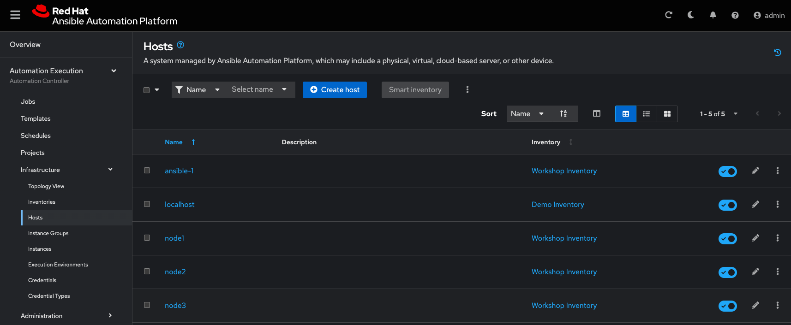
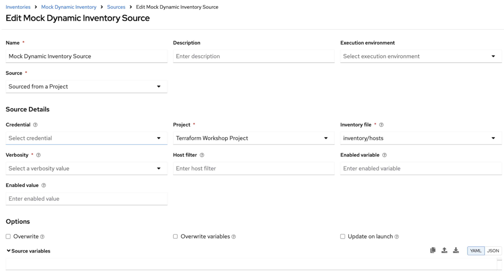

# Workshop Exercise: Managing Credentials, Projects, and Inventories in Ansible Automation Controller

## Objective
This workshop provides practical experience with managing inventories and credentials in  automation controller. You’ll learn how to navigate a preloaded inventory, understand its structure, and set up machine credentials for accessing managed hosts.

## Table of Contents

1. [Understanding Machine Credentials](#4-understanding-machine-credentials)
2. [Additional Credential Types](#5-additional-credential-types)
3. [Add Vault Credential](#6-add-vault-credential)
4. [Introduction to Projects](#4-introduction-to-projects)
5. [Add "Terraform Project"](#5-add-terraform-workshop-project)
6. [Introduction to Inventories](#6-introduction-to-inventories)
7. [Exploring the 'Workshop Inventory'](#7-exploring-the-workshop-inventory)
8. [Add "Mock Dynamic Inventory"](#8-add-mock-dynamic-inventory)
9. [Add "Mock Dynamic Inventory Source"](#9-add-mock-dynamic-inventory-source)
10. [Conclusion](#10-conclusion)

### 1. Understanding Machine Credentials
Machine credentials are essential for establishing secure SSH connections to managed hosts.

- **Accessing Credentials:** Navigate to **Automation Execution → Infrastructure→ Credentials** and select _Workshop Credentials_.
- **Credential Details:** The 'Workshop Credentials' is configured with:
  - **Credential Type:** Machine (for SSH).
  - **Username:** A predefined user, such as `ec2-user`.
  - **SSH Private Key:** Encrypted, providing secure access to hosts.

### 2. Additional Credential Types
Automation controller supports over 30 different credential types for various automation tasks. Here are a few common ones:

- **Network Credentials:** For managing network devices.
- **Source Control Credentials:** For accessing source control systems.
- **Amazon Web Services (AWS) Credentials:** For integrating with AWS services.

These credential types enhance the flexibility and security of your automation efforts.

### 3. Add Vault Credential

* Go to **Automation Execution → Infrastructure → Credentials** click the **Create Credential** button. Fill in the form:

 <table>
   <tr>
     <th>Parameter</th>
     <th>Value</th>
   </tr>
   <tr>
     <td>Name</td>
     <td>vault</td>
   </tr>
   <tr>
     <td>Organization</td>
     <td>Default</td>
   </tr>
   <tr>
     <td>Credential Type</td>
     <td>Vault</td>
   </tr>
   <tr>
     <td>Vault Password</td>
     <td>R3dh4t1!</td>
   </tr>
 </table>

* Click **Create credential** button

### 4. Introduction to Projects

An Ansible automation controller **Project** is a logical collection of Ansible playbooks. You can manage your playbooks by placing them into a source code management (SCM) system supported by automation controller such as Git or Subversion.

This exercise covers:

* Understanding and using an Ansible automation controller Project

### 5. Add "Terraform Workshop Project"
* Go to **Automation Execution → Projects** click the **Create project** button. Fill in the form:

 <table>
   <tr>
     <th>Parameter</th>
     <th>Value</th>
   </tr>
   <tr>
     <td>Name</td>
     <td>Terraform Workshop Project</td>
   </tr>
   <tr>
     <td>Organization</td>
     <td>Default</td>
   </tr>
   <tr>
     <td>Execution Environment</td>
     <td>Default execution environment</td>
   </tr>
   <tr>
     <td>Source control type</td>
     <td>Git</td>
   </tr>
   <tr>
     <td>Source control URL</td>
     <td>https://github.com/mkbredem/aap_tfc_workshop.git</td>
   </tr>
 </table>

* Click **Create project** button

### 6. Introduction to Inventories
In automation controller, inventories define and organize the hosts your playbooks will target. They can be static (a fixed list of hosts) or dynamic (sourced from external systems).

### 7. Exploring the _Workshop Inventory_
The _Workshop Inventory_ is preloaded in your lab environment, representing a static inventory configuration.

- **Accessing the Inventory:** Navigate to **Automation Execution → Infrastructure → Inventories** in the web UI, and select _Workshop Inventory_.
- **Viewing Hosts:** Navigate to **Automation Execution → Infrastructure → Hosts** to see the predefined hosts, similar to those in a traditional Ansible inventory file.

### 8. Add "Mock Dynamic Inventory"
The Workshop Inventory above is pre-built, however this workshop is designed to mimic the fact that inventories will be dynamically pulled from the hyperscaler/hypervisor that terraform builds from the main.tf file.  To mimic this, we will dynamically pull the inventory from a project.

In a true integration with AAP and Terraform, you will be able to dynamically pull inventories from the hypervisor and group them based on tags, which those groups would then be targeted for post-provisioning configuration.

* Go to **Automation Execution → Infrastructure → Inventories** click the **Create inventory** button. Fill in the form:

 <table>
   <tr>
     <th>Parameter</th>
     <th>Value</th>
   </tr>
   <tr>
     <td>Name</td>
     <td>Mock Dynamic Inventory</td>
   </tr>
   <tr>
     <td>Organization</td>
     <td>Default</td>
   </tr>
 </table>

* Click **Create inventory** button

### 9. Add "Mock Dynamic Inventory Source"
Now for the dynamic inventory source that would sync after provisioning and before configuration.

* Go to “Sources” (tab) of **Mock Dynamic Inventory** → Click **“Create Source”**. Fill in the form:

 <table>
   <tr>
     <th>Parameter</th>
     <th>Value</th>
   </tr>
   <tr>
     <td>Name</td>
     <td>Mock Dynamic Inventory Source</td>
   </tr>
   <tr>
     <td>Organization</td>
     <td>Default</td>
   </tr>
   <tr>
     <td>Source</td>
     <td>Sourced from a Project</td>
   </tr>
   <tr>
     <td>Project</td>
     <td>Terraform Workshop Project</td>
   </tr>
   <tr>
     <td>Inventory file</td>
     <td>inventory/hosts</td>
   </tr>
 </table>

* Click **Create source** button

> **Tip**
>
> **Your inventory source should look like this**

### 10. Conclusion
Throughout this exercise, you explored key building blocks of Ansible Automation Controller—credentials, projects, and inventories—that are foundational to scalable and secure automation.

You began by working with machine credentials and vault credentials, which ensure secure and role-based access to systems and secrets. Then, you defined a project to source playbooks from Git, simulating modern DevOps workflows that integrate infrastructure as code with configuration automation.

By creating and exploring both static and mock dynamic inventories, you mimicked real-world provisioning scenarios, where dynamic sources like cloud providers or Terraform output are used to populate and target hosts. This exercise prepared you to design workflows that adapt automatically as infrastructure changes.

Mastering these controller concepts equips you to build more robust, maintainable automation pipelines—whether you’re configuring a single server or orchestrating a hybrid cloud fleet.

You’re now ready to build some job templates (playbook executions).

---
**Navigation**
 [Previous Exercise](../2.1-intro) | [Next Exercise](../2.3-jobtemplates/) 
[Click here to return to the Ansible for Red Hat Enterprise Linux Workshop](../README.md#section-2---ansible-tower-exercises)

