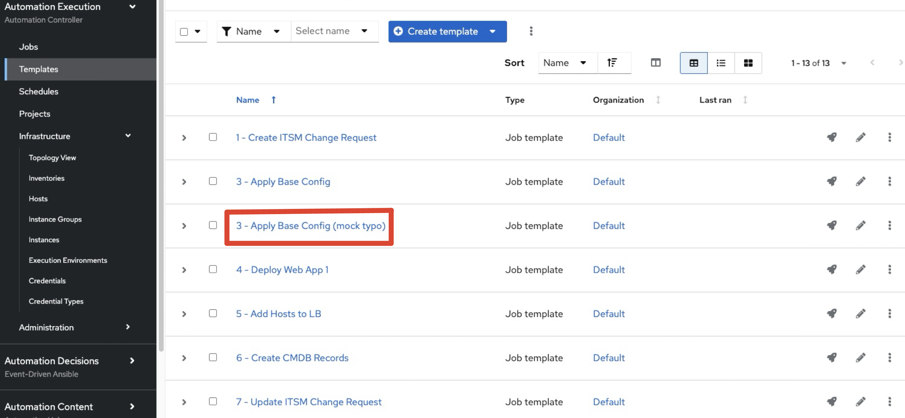

# Workshop Exercise - Job Templates

## Table Contents

* [Objective](#objective)
* [Guide](#guide)
* [Setup Workshop](#add-setup-job-template)
* [Add Workshop Job Templates](#add-all-the-job-templates-needed-for-post-provisioning-configuration)
  * [1. Base Config](#1-base-config)
  * [2. Create CR](#2-create-cr)
  * [3. Deploy Application](#3-deploy-application)
  * [4.Add Hosts to Load Balancer](#4-add-hosts-to-load-balancer)
  * [5. Add hosts to CMDB](#5-add-hosts-to-cmdb)
  * [6. Update CR](#6-update-cr)
  * [7. Create Incident](#7-create-incident)
* [Solution: Add Workshop Job Templates](#solution-1-run-job-template-to-build-additional-resources-cac)
* [Create a Job Template and Run a Job](#create-a-job-template-and-run-a-job)
* [Challenge Lab: Check the Result](#challenge-lab-check-the-result)
* [What About Some Practice?](#what-about-some-practice)

## Objective

A **job template** allows you to run an automation job. In order to run any type of automation, a job template must be created. A job template consists of knowning the following information:

Inventory: On what hosts should the job run?

Credentials What credentials are needed to log into the hosts?

Project: Where is the playbook?

Playbook: What playbook to use?

This exercise covers:

* Understanding and using/defining Ansible automation controller Job Templates
* Using a Job Template to create more Job Templates.

## Guide

### Add "Setup Job Template"
The first template we will add, runs a playbook that automates AAP itself using configuration as code.  This job template will build out other resources (credentials, inventories, and job templates) that will be needed for the rest of the workshop (solutions and shortcuts).  

#### Create “Setup” job template:
* Go to **Automation Execution → Templates** click **Create Template** select **Create job template** . Fill in the form:

 <table>
   <tr>
     <th>Parameter</th>
     <th>Value</th>
   </tr>
   <tr>
     <td>Name</td>
     <td>Setup</td>
   </tr>
   <tr>
     <td>Project</td>
     <td>Terraform Workshop Project</td>
   </tr>
   <tr>
     <td>Inventory</td>
     <td>Demo Inventory</td>
   </tr>
   <tr>
     <td>Playbook</td>
     <td>setup_workshop_solutions.yml</td>
   </tr>
   <tr>
     <td>Execution Environment</td>
     <td>Default execution environment</td>
   </tr>
   <tr>
     <td>Playbook</td>
     <td>setup_workshop_solutions.yml</td>
   </tr>
   <tr>
     <td>Credentials</td>
     <td>
       Demo Credential | Machine 
       vault | Vault 
     </td>
   </tr>
   <tr>
     <td>Extra Vars</td>
     <td>
       <pre><code>controller_hostname: controller.&lt;CHANGE&gt;.sandbox&lt;CHANGE&gt;.opentlc.com
aap_password: R3dh4t1!
aap_service_account_password: R3dh4t1!
student_account: admin</code></pre>
     </td>
   </tr>
 </table>

* Click **Create job template** 
* Click **Launch template** click to run the Setup JT

Since this might take some time, have a closer look at all the details provided:

* All details of the job template like inventory, project, credentials and playbook are shown.

* Additionally, the actual revision of the playbook is recorded here - this makes it easier to analyse job runs later on.

* Also the time of execution with start and end time is recorded, giving you an idea of how long a job execution actually was.

* Selecting **Output** shows the output of the running playbook. Click on a node underneath a task and see that detailed information are provided for each task of each node.

Once it is done running, see the following resources were created for you:
* Go to **Automation Execution → Templates**

* **Solution1 - Add Job Templates:** We will be adding more job templates, to mimic a post provisioning workflow (base config -> application deployment → load balancer -> CMDB update -> ITSM tracking, etc…).  You can use this Solution1 to make sure all the Job Templates are built correctly.
* **Solution2 - complete config and deploy workflow:** wonce the job templates are added, you will be stitching them together in a Workflow Job Template.  Again, this may take more time than the lab will allow, so you can complete the Workflow using this Solution2.
* **Solution3 - Decommission Workflow Job Template:** This playbook adds additional job templates and completes an additional Workflow that is used to mimic the decommissioning process. Similar to Solution1 and Solution2 combined, but for the Decommissioning workflow.

* Go to **Automation Execution → Infrastructure → Credentials**

* **AAP Credential:** this credential is used by the Solution[1:3] to authenticate into the Automation Controller API, similar to the Extra Vars you pasted into the **Setup** job template.

## Add all the job templates needed for post provisioning configuration
The next 7 tasks is simply building out more job templates that we will ultimately be stitching together into a workflow job template.  Please read the tips below before you begin building.

> **Tip**
>
> Copy and paste the Name value into the Job Templates, so if a Solution is used, the job templates you created will simply be updated or skipped if no changes are identified, otherwise, you will have similarly named, redundant, job templates when a solution runs.

> **Tip**
>
> if at any point you’ve had enough practice building job templates, or if you get the idea, you can skipp to [Solution1](#solution-1-run-job-template-to-build-additional-resources-cac) to have ansible create all these jobs templates for you.

### 1. Base Config
The logical place to start would be to perform a base configuration of the newly provisioned servers.  This may include things like hardening configurations, installing and activating security agents, and other compliance requirements needed on all servers:

* Go to **Automation Execution → Templates** click the **Create Template** button. Fill in the form:

 <table>
   <tr>
     <th>Parameter</th>
     <th>Value</th>
   </tr>
   <tr>
     <td>Name</td>
     <td>3 - Apply Base Config</td>
   </tr>
   <tr>
     <td>Organization</td>
     <td>Default</td>
   </tr>
   <tr>
     <td>Inventory</td>
     <td>Mock Dynamic Inventory</td>
   </tr>
   <tr>
     <td>Project</td>
     <td>Terraform Workshop Project</td>
   </tr>
   <tr>
     <td>Playbook</td>
     <td>common_config.yml</td>
   </tr>
   <tr>
     <td>Execution Environment</td>
     <td>Default execution environment</td>
   </tr>
   <tr>
     <td>Credentials</td>
     <td>
       Workshop Credentials | Machine 
       Vault | Vault 
     </td>
  </tr>
 </table>

* Click **Create job template** 

### 2. Create CR
In order to track resources being created in ITSM, we need to create a change request:

* Go to **Automation Execution → Templates** click the **Create Template** button. Fill in the form:

 <table>
   <tr>
     <th>Parameter</th>
     <th>Value</th>
   </tr>
   <tr>
     <td>Name</td>
     <td>1 - Create ITSM Change Request</td>
   </tr>
   <tr>
     <td>Organization</td>
     <td>Defualt</td>
   </tr>
   <tr>
     <td>Inventory</td>
     <td>Demo Inventory</td>
   </tr>
   <tr>
     <td>Project</td>
     <td>Terraform Workshop Project</td>
   </tr>
   <tr>
     <td>Playbook</td>
     <td>servicenow_catalog_create.yml</td>
   </tr>
   <tr>
     <td>Execution Environment</td>
     <td>Default execution environment</td>
   </tr>
   <tr>
     <td>Credentials</td>
     <td>Demo Credential | Machine</td>
   </tr> 
 </table>

* Click **Create job template** 

### 3. Deploy Application
Upon successful completion of the Common Config, we will need to run additional configurations in order to deploy the application that will run on the server.

* Go to **Automation Execution → Templates** click the **Create Template** button. Fill in the form:

 <table>
   <tr>
     <th>Parameter</th>
     <th>Value</th>
   </tr>
   <tr>
     <td>Name</td>
     <td>4 - Deploy Web App 1</td>
   </tr>
   <tr>
     <td>Organization</td>
     <td>Default</td>
   </tr>
   <tr>
     <td>Inventory</td>
     <td>Mock Dynamic Inventory</td>
   </tr>
   <tr>
     <td>Project</td>
     <td>Terraform Workshop Project</td>
   </tr>
   <tr>
     <td>Playbook</td>
     <td>deploy_web_app.yml</td>
   </tr>
   <tr>
     <td>Execution Environment</td>
     <td>Default execution environment</td>
   </tr>
   <tr>
     <td>Credentials</td>
     <td>
       Workshop Credentials | Machine 
       Vault | Vault 
     </td>
  </tr>
 </table>

* Click **Create job template** 

### 4. Add Hosts to Load Balancer
Then we will need to add the host(s) to a load balancer.  Since this is targeting a device external to the inventory we are configuring directly, we will need to create a separate job template for this piece as well.

* Go to **Automation Execution → Templates** click the **Create Template** button. Fill in the form:

 <table>
   <tr>
     <th>Parameter</th>
     <th>Value</th>
   </tr>
   <tr>
     <td>Name</td>
     <td>5 - Add Hosts to LB</td>
   </tr>
   <tr>
     <td>Organization</td>
     <td>Defualt</td>
   </tr>
   <tr>
     <td>Inventory</td>
     <td>Demo Inventory</td>
   </tr>
   <tr>
     <td>Project</td>
     <td>Terraform Workshop Project</td>
   </tr>
   <tr>
     <td>Playbook</td>
     <td>add_ip_lb.yml</td>
   </tr>
   <tr>
     <td>Execution Environment</td>
     <td>Default execution environment</td>
   </tr>
   <tr>
     <td>Credentials</td>
     <td>Demo Credential | Machine</td>
   </tr> 
 </table>

* Click **Create job template** 

### 5. Add hosts to CMDB
Now that the server is configured and the app deployoed, we will need to add it to our CMDB database, our single source of truth.

* Go to **Automation Execution → Templates** click the **Create Template** button. Fill in the form:

 <table>
   <tr>
     <th>Parameter</th>
     <th>Value</th>
   </tr>
   <tr>
     <td>Name</td>
     <td>6 - Create CMDB Records</td>
   </tr>
   <tr>
     <td>Organization</td>
     <td>Defualt</td>
   </tr>
   <tr>
     <td>Inventory</td>
     <td>Demo Inventory</td>
   </tr>
   <tr>
     <td>Project</td>
     <td>Terraform Workshop Project</td>
   </tr>
   <tr>
     <td>Playbook</td>
     <td>servicenow_cmdb_create.yml</td>
   </tr>
   <tr>
     <td>Execution Environment</td>
     <td>Default execution environment</td>
   </tr>
   <tr>
     <td>Credentials</td>
     <td>Demo Credential | Machine</td>
   </tr> 
 </table>

* Click **Create job template**

### 6. Update CR
We will need to periodically update the change request we created earlier with notes to indicate progress (i.e. common config complete, app deploy complete, or even app deploy fail, etc…).

* Go to **Automation Execution → Templates** click the **Create Template** button. Fill in the form:

 <table>
   <tr>
     <th>Parameter</th>
     <th>Value</th>
   </tr>
   <tr>
     <td>Name</td>
     <td>7 - Update ITSM Change Request</td>
   </tr>
   <tr>
     <td>Organization</td>
     <td>Defualt</td>
   </tr>
   <tr>
     <td>Inventory</td>
     <td>Demo Inventory</td>
   </tr>
   <tr>
     <td>Project</td>
     <td>Terraform Workshop Project</td>
   </tr>
   <tr>
     <td>Playbook</td>
     <td>servicenow_catalog_update.yml</td>
   </tr>
   <tr>
     <td>Execution Environment</td>
     <td>Default execution environment</td>
   </tr>
   <tr>
     <td>Credentials</td>
     <td>Demo Credential | Machine</td>
   </tr> 
 </table>

* Click **Create job template**

### 7. Create Incident
What if one of the configuration, deploy, adding to loadbalancer job fail?  We will need to create an incident for investigation and/or remediation, to finish and test the configurations.

* Go to **Automation Execution → Templates** click the **Create Template** button. Fill in the form:

 <table>
   <tr>
     <th>Parameter</th>
     <th>Value</th>
   </tr>
   <tr>
     <td>Name</td>
     <td>8 - Create ITSM Incident</td>
   </tr>
   <tr>
     <td>Organization</td>
     <td>Defualt</td>
   </tr>
   <tr>
     <td>Inventory</td>
     <td>Demo Inventory</td>
   </tr>
   <tr>
     <td>Project</td>
     <td>Terraform Workshop Project</td>
   </tr>
   <tr>
     <td>Playbook</td>
     <td>servicenow_incident_create.yml</td>
   </tr>
   <tr>
     <td>Execution Environment</td>
     <td>Default execution environment</td>
   </tr>
   <tr>
     <td>Credentials</td>
     <td>Demo Credential | Machine</td>
   </tr> 
 </table>

* Click **Create job template**

### Solution 1: Run Job Template to build additional resources (CaC)
We are covering a lot of ground in a short period of time, so feel free to run this Job to finish creating the Job Templates above.

Goto **Automation Execution → Templates** Launch **Solution1 - Add Job Templates** (click the rocket icon)
* After it is finished running, you will see all the job templates from the previous exercise:
* Goto **Automation Execution → Templates**
> **Tip**
>
>  You may seem some duplicates if there was a typo in the Name of the job template.  You can delete the one(s) that had(have) a typo.

---
**Navigation**
 
[Previous Exercise](../2.2-cred) - [Next Exercise](../2.4-workflows/)

[Click here to return to the Ansible for Red Hat Enterprise Linux Workshop](../README.md#section-2---ansible-tower-exercises)
