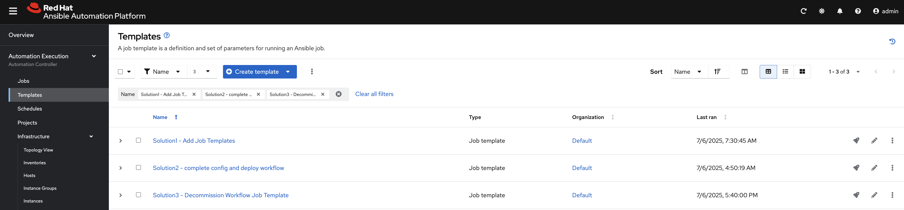
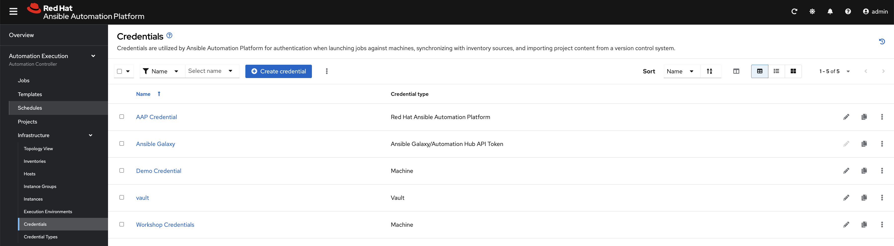
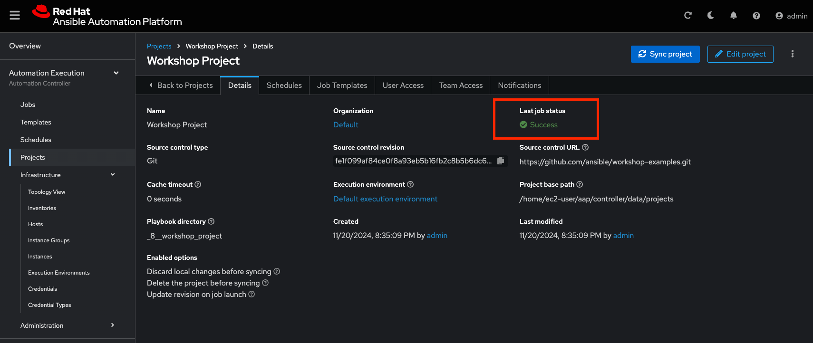
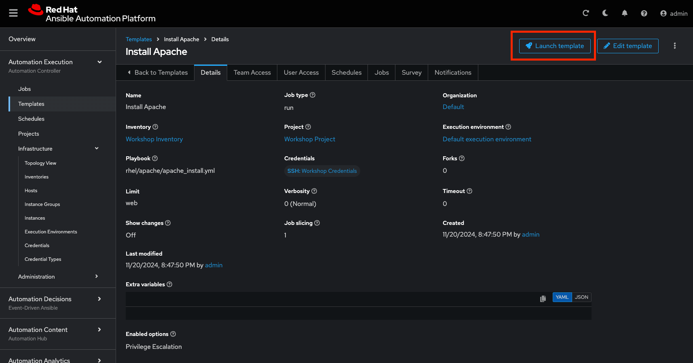

# Workshop Exercise - Projects & Job Templates

## Table Contents

* [Objective](#objective)
* [Guide](#guide)
* [Setup Git Repository](#setup-git-repository)
* [Create the Project](#create-the-project)
* [Create a Job Template and Run a Job](#create-a-job-template-and-run-a-job)
* [Challenge Lab: Check the Result](#challenge-lab-check-the-result)
* [What About Some Practice?](#what-about-some-practice)

## Objective

A **job template** allows you to run an automation job. In order to run any type of automation, a job template must be created. A job template consists of knowning the following information:

Inventory: On what hosts should the job run?

Credentials What credentials are needed to log into the hosts?

Project: Where is the playbook?

Playbook: What playbook to use?

This exercise covers:

* Understanding and using/defining Ansible automation controller Job Templates
* Using a Job Template to create more Job Templates.

## Guide

### Add "Setup Job Template"
The first template we will add runs a playbook that actually automates AAP itself using configuration as code.  This job template will build out other resources (credentials, inventories, and job templates) that can optionally be used needed for the rest of the workshop, as well as provide solutions or shortcuts.  

### Create “Setup” job template:
* Go to **Automation Execution → Templates** click the **Create Template** button. Fill in the form:

 <table>
   <tr>
     <th>Parameter</th>
     <th>Value</th>
   </tr>
   <tr>
     <td>Name</td>
     <td>Setup</td>
   </tr>
   <tr>
     <td>Organization</td>
     <td>Default</td>
   </tr>
   <tr>
     <td>Project</td>
     <td>Terraform Workshop Project</td>
   </tr>
   <tr>
     <td>Inventory</td>
     <td>Demo Inventory</td>
   </tr>
   <tr>
     <td>Playbook</td>
     <td>setup_workshop_solutions.yml</td>
   </tr>
   <tr>
     <td>Execution Environment</td>
     <td>Default execution environment</td>
   </tr>
   <tr>
     <td>Playbook</td>
     <td>setup_workshop_solutions.yml</td>
   </tr>
   <tr>
     <td>Credentials</td>
     <td>Demo Credential | Vault</td>
   </tr>
   <tr>
     <td>Extra Vars</td>
     <td>
       <pre><code>controller_hostname: controller.&lt;CHANGE&gt;.sandbox&lt;CHANGE&gt;.opentlc.com
aap_password: R3dh4t1!
aap_service_account_password: R3dh4t1!
student_account: admin</code></pre>
     </td>
   </tr>
 </table>

* Click **Create job template** 
* Click **Launch template** click to run the Setup JT

Once it is done running, see the following resources were created for you:
* Go to **Automation Execution → Templates**

* **Solution1 - Add Job Templates:** We will be adding more job templates, to mimic a post provisioning workflow (base config -> application deployment → load balancer -> CMDB update -> ITSM tracking, etc…).  You can use this Solution1 to make sure all the Job Templates are built correctly.
* **Solution2 - complete config and deploy workflow:** wonce the job templates are added, you will be stitching them together in a Workflow Job Template.  Again, this may take more time than the lab will allow, so you can complete the Workflow using this Solution2.
* **Solution3 - Decommission Workflow Job Template:** This playbook adds additional job templates and completes an additional Workflow that is used to mimic the decommissioning process. Similar to Solution1 and Solution2 combined, but for the Decommissioning workflow.

* Go to **Automation Execution → Infrastructure → Credentials**

* **AAP Credential:** this credential is used by the Solution[1:3] to authenticate into the Automation Controller API, similar to the Extra Vars you pasted into **Setup** job template in **Step 6**.

> **Tip**
>
> Note the difference from other playbooks you might have written\! Most importantly there is no `become` and `hosts` is set to `web`.

To configure and use this repository as a **Source Control Management (SCM)** system in automation controller you have to create a **Project** that uses the repository

### Create the Project

* Go to **Automation Execution → Projects** click the **Create Project** button. Fill in the form:

 <table>
   <tr>
     <th>Parameter</th>
     <th>Value</th>
   </tr>
   <tr>
     <td>Name</td>
     <td>Workshop Project</td>
   </tr>
   <tr>
     <td>Organization</td>
     <td>Default</td>
   </tr>
   <tr>
     <td>Execution Environment</td>
     <td>Default execution environment</td>
   </tr>
   <tr>
     <td>Source Control Type</td>
     <td>Git</td>
   </tr>
 </table>

 Enter the URL into the Project configuration:

 <table>
   <tr>
     <th>Parameter</th>
     <th>Value</th>
   </tr>
   <tr>
     <td>Source Control URL</td>
     <td><code>https://github.com/ansible/workshop-examples.git</code></td>
   </tr>
   <tr>
     <td>Options</td>
     <td>Select Clean, Delete, Update Revision on Launch to request a fresh copy of the repository and to update the repository when launching a job.</td>
   </tr>
 </table>

* Click **Create project**

The new project will be synced automatically after creation. But you can also do this manually: Sync the Project again by selecting the 'Sync project' blue button.

After starting the sync job, go to the **Jobs** view, and you'll find the job doing the project update.

### Create a Job Template and Run a Job

A job template allows you to run an automation job. In order to run any type of automation, a job template must be created. A job template consists of knowning the following information:

* **Inventory**: On what hosts should the job run?

* **Credentials** What credentials are needed to log into the hosts?

* **Project**: Where is the playbook?

* **Playbook**: What playbook to use?

To create a Job Template, go to the **Automation Execution -> Templates** view,click the **Create template** button and choose **Create job template**.

> **Tip**
>
> Remember that you can often click on the question mark with a circle to get more details about the field.

 <table>
   <tr>
     <th>Parameter</th>
     <th>Value</th>
   </tr>
   <tr>
     <td>Name</td>
     <td>Install Apache</td>
   </tr>
   <tr>
     <td>Job Type</td>
     <td>Run</td>
   </tr>
   <tr>
     <td>Inventory</td>
     <td>Workshop Inventory</td>
   </tr>
   <tr>
     <td>Project</td>
     <td>Workshop Project</td>
   </tr>
   <tr>
     <td>Playbook</td>
     <td><code>rhel/apache/apache_install.yml</code></td>
   </tr>
   <tr>
     <td>Execution Environment</td>
     <td>Default execution environment</td>
   </tr>
   <tr>
     <td>Credentials</td>
     <td>Workshop Credential</td>
   </tr>
   <tr>
     <td>Limit</td>
     <td>web</td>
   </tr>
   <tr>
     <td>Options</td>
     <td>tasks need to run as root so check **Privilege Escalation**</td>
   </tr>
 </table>

* Click **Create job template**

You can start the job by directly clicking the blue **Launch template** button, or by clicking on the rocket in the Job Templates overview. After launching the Job Template, you are automatically brought to the job overview where you can follow the playbook execution in real time.

Template Details

Job Run

Since this might take some time, have a closer look at all the details provided:

* All details of the job template like inventory, project, credentials and playbook are shown.

* Additionally, the actual revision of the playbook is recorded here - this makes it easier to analyse job runs later on.

* Also the time of execution with start and end time is recorded, giving you an idea of how long a job execution actually was.

* Selecting **Output** shows the output of the running playbook. Click on a node underneath a task and see that detailed information are provided for each task of each node.

After the Job has finished go to the main **Jobs** view: All jobs are listed here, you should see directly before the Playbook run an Source Control Update was started. This is the Git update we configured for the **Project** on launch\!

### Challenge Lab: Check the Result

Time for a little challenge:

* Use an ad hoc command on both hosts to make sure Apache has been installed and is running.

You have already been through all the steps needed, so try this for yourself.

> **Tip**
>
> What about `systemctl status httpd`?

> **Warning**
>
> **Solution Below**

* Go to **Automation Execution → Infrastructure →  Inventories** → **Workshop Inventory**

* In the **Automation Execution → Infrastructure → Inventories → Workshop Inventory**, select the **Hosts** tab and select `node1`, `node2`, `node3` and click **Run Command**

Within the **Details** window, select **Module** `command`, in **Arguments** type `systemctl status httpd` and click **Next**.

Within the **Execution Environment** window, select **Default execution environment** and click **Next**.

Within the **Credential** window, select **Workshop Credentials** and click **Next**.

Review your inputs and click **Finish**.

Verify that the output result is as expected.

> **Tip**
>
> The output of the results is displayed once the command has completed.

---
**Navigation**
 
[Previous Exercise](../2.2-cred) - [Next Exercise](../2.4-surveys)

[Click here to return to the Ansible for Red Hat Enterprise Linux Workshop](../README.md#section-2---ansible-tower-exercises)
