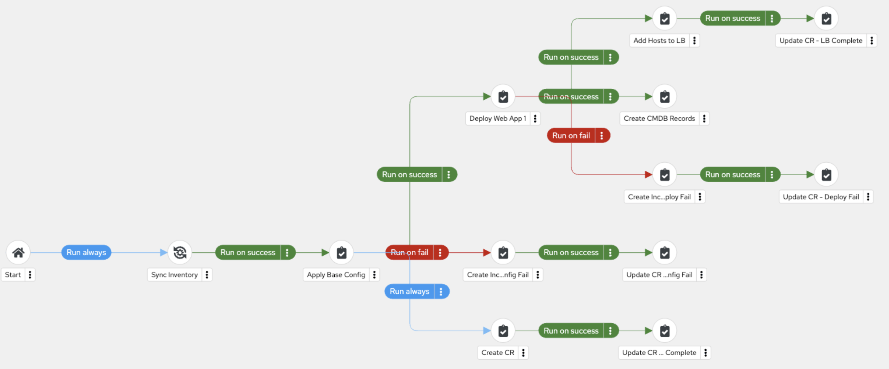
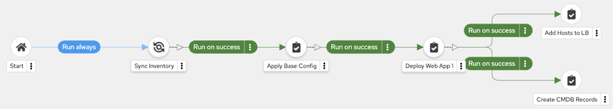
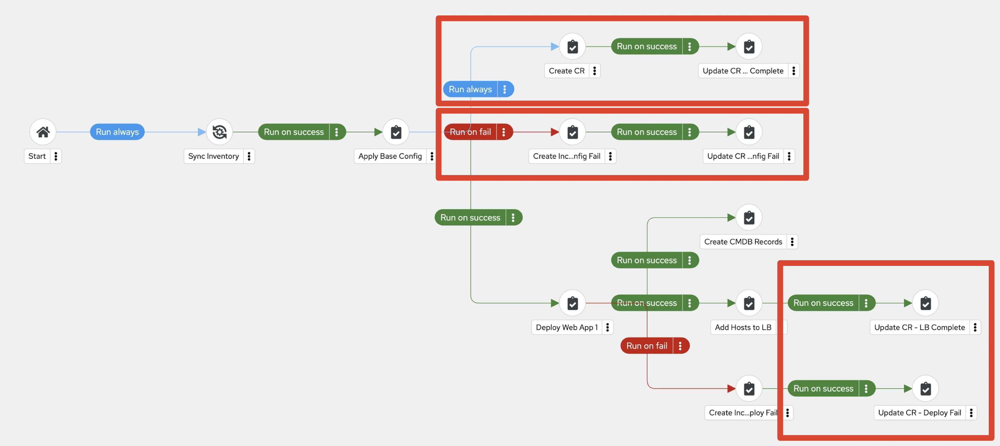

# Workshop Exercise - Workflows

## Table of Contents

* [Objective](#objective)
* [Create Post-Provisioning Workflow Job Template](#create-post-provisioning-configuration-workflow-job-template)
  * [1. Create The Workflow](#1-create-the-workflow)
  * [2. Sync Inventory](#2-sync-inventory)
  * [3. Apply Base Config](#3-apply-base-config)
  * [4. Deploy Web App](#4-deploy-web-app)
  * [5. Add Hosts to Load Balancer](#5-add-hosts-to-load-balancer)
  * [6. Add Servers to CMDB](#6-add-servers-to-cmdb)
  * [7. Create Incident Upon Failure](#7-create-incident-upon-failure)
  * [8. Rinse and Repeat](#rinse-and-repeat)
* [Solutoin 2: Run Job Template to build pos-provisioning workflow](#solution-2-run-job-template-to-build-post-provisioning-workflow-job-template)

## Objective

The purpose of a workflow is to link multiple job templates together. These templates may or may not share inventory, playbooks, or permissions. The links can be conditional:

* If Job Template A succeeds, Job Template B is executed next.
* If it fails, Job Template C runs instead.

Workflows can include not only job templates but also project or inventory syncs.

This flexibility allows different teams to collaborate efficiently. For example, a networking team can manage its own repositories and inventories, while an operations team handles other aspects. In this lab, you’ll learn how to set up a workflow.

## Create Post-Provisioning Configuration Workflow Job Template
Recall, each job template is tied to a playbook, and we need to stitch together a lot of playbooks to complete a post-provisioning configuration workflow.

> **Tip**
>
> if at any point you’ve had enough practice building out the workflow, or if you get the idea, you can skip to Solution 2 to have ansible create the workflow for you.

> **Tip**
>
>  When creating a workflow, you must click “Save” in the top left of the Wokflow Visualizer.  This will save your progress.  If your session times out before you click “Save” you will lose your progress. **(CLICK SAVE AFTER EACH STEP)**

### 1. Create The Workflow
* Go to **Automation Execution → Templates**** Click **Create Template** → Select **Create workflow job template**. Fill in the form as follows:

 <table>
   <tr>
     <th>Parameter</th>
     <th>Value</th>
   </tr>
   <tr>
     <td>Name</td>
     <td>Init and Deploy Web App 1 - practice</td>
   </tr>
   <tr>
     <td>Organization</td>
     <td>Default</td>
 </table>

* Click **Create workflow job template** 

Preview of finished workflow:


### 2. Sync Inventory
Sync your inventory first to ensure the newly provisioned servers are in your inventory

* Click ***“+Add Step”***. Fill in the form as follows:

 <table>
   <tr>
     <th>Parameter</th>
     <th>Value</th>
   </tr>
   <tr>
     <td>Node Type</td>
     <td>Inventory Source Sync</td>
   </tr>
   <tr>
     <td>Inventory Source</td>
     <td>Mock Dynamic Inventory Source</td>
   <tr>
     <th>Covergence</th>
     <th>Any</th>
   </tr>
   <tr>
     <td>Node Alias</td>
     <td>Sync Inventory</td>
   </tr>
 </table>

* Click **Next**
* Click **Finish**
			
### 3. Apply Base Config
After successful inventory sync, we will begin applying the base config

* Click **<3 dots>** (right of **Sync Inventory**)
* Select **+Add step and link**. Fill in the form as follows:

 <table>
   <tr>
     <th>Parameter</th>
     <th>Value</th>
   </tr>
   <tr>
     <td>Node Type</td>
     <td>Job Template</td>
   </tr>
   <tr>
     <td>Job template</td>
     <td>3 - Apply Base Config</td>
   </tr>
   <tr>
     <td>Status</td>
     <td>Run on success</td>
   </tr>
   <tr>
     <td>Covergence</td>
     <td>Any</td>
   </tr>
   <tr>
     <td>Node Alias</td>
     <td>Apply Base Config</td>
   </tr>
 </table>


* Click **Next**
* Click **Finish**

### 4. Deploy Web App
After successful base config, we will begin application deployment
* Click **<3 dots>** (right of **Apply Base Config**)
* Select **+Add step and link**. Fill in the form as follows:

 <table>
   <tr>
     <th>Parameter</th>
     <th>Value</th>
   </tr>
   <tr>
     <td>Node Type</td>
     <td>Job Template</td>
   </tr>
   <tr>
     <td>Job template</td>
     <td>4 - Deploy Web App 1g</td>
   </tr>
   <tr>
     <td>Status</td>
     <td>Run on success</td>
   </tr>
   <tr>
     <td>Covergence</td>
     <td>Any</td>
   </tr>
   <tr>
     <td>Node Alias</td>
     <td>Deploy Web App 1</td>
   </tr>
 </table>

* Click **Next**
* Click **Finish**

### 5. Add Hosts to Load Balancer
After successful app deploy, we will add the hosts to a load balancer
* Click **<3 dots>** (right of **Deploy Web App 1**)
* Select **+Add step and link**. Fill in the form as follows:

 <table>
   <tr>
     <th>Parameter</th>
     <th>Value</th>
   </tr>
   <tr>
     <td>Node Type</td>
     <td>Job Template</td>
   </tr>
   <tr>
     <td>Job template</td>
     <td>5 - Add Hosts to LB</td>
   <tr>
     <td>Status</td>
     <td>Run on success</td>
   <tr>
   <tr>
     <td>Covergence</td>
     <td>Any</td>
   </tr>
   <tr>
     <td>Node Alias</td>
     <td>Add Hosts to LB</td>
   </tr>
 </table>

* Click **Next**
* Click **Finish**

### 6. Add Servers to CMDB
With Workflows, you can run to jobs in parallel.  While we are adding the servers to the LB, we will also add the hosts to our CMDB database.  Play close attention to the steps below:
* Again, Click **<3 dots>** to the right of **Deploy Web App 1**
* Select **+Add step and link** Fill in the form as follows:


 <table>
   <tr>
     <th>Parameter</th>
     <th>Value</th>
   </tr>
   <tr>
     <td>Node Type</td>
     <td>Job Template</td>
   </tr>
   <tr>
     <td>Job template</td>
     <td>6 - Create CMDB Records</td>
   <tr>
     <td>Status</td>
     <td>Run on success</td>
   <tr>
   <tr>
     <td>Covergence</td>
     <td>Any</td>
   </tr>
   <tr>
     <td>Node Alias</td>
     <td>Create CMDB Records</td>
   </tr>
 </table>

* Click **Next**
* Click **Finish**

> **Tip**
>
>  The workflow will update with a fork at Deploy Web App 1


### 7. Create Incident Upon Failure
With Workflows, you can take alternative paths if a job fails.  This is important because it needs to be documented, fixed, or reworked.  Let’s create a node that runs if Deploy Web App 1 fails.

* Again, Click **<3 dots>** to the right of **Deploy Web App 1**
* Select **+Add step and link** Fill in the form as follows:

 <table>
   <tr>
     <th>Parameter</th>
     <th>Value</th>
   </tr>
   <tr>
     <td>Node Type</td>
     <td>Job Template</td>
   </tr>
   <tr>
     <td>Job template</td>
     <td>8 - Create ITSM Incident</td>
   <tr>
     <td>Status</td>
     <td>Run on fail</td>
   <tr>
   <tr>
     <td>Covergence</td>
     <td>Any</td>
   </tr>
   <tr>
     <td>Node Alias</td>
     <td>Create Incident - Deploy Fail</td>
   </tr>
 </table>

* Click **Next**
* Click **Finish**

### Rinse and Repeat
We have now implemented the core features of the workflow, to finish the workflow you would continue to “+Add step and link” to the nodes based on the logic of your environment.  To save time, lets let ansible finish the workflow.  [proceed to solution 2](#solution-2-run-job-template-to-build-post-provisioning-workflow-job-template)

## Solution 2: Run Job Template to build post provisioning workflow job template
1. Goto **Automation Execution → Templates** Launch **Solution2 - complete config and deploy workflow** (click rocket)
2. After it is finished running, you will see the completed **Init and Deploy Web App 1** Workflow Job Template.
  * Goto **Automation Execution → Templates**
  * Select **Init and Deploy Web App 1** link
  * Click the **View Workflow Visualizer button** (located top right)

> **Tip**
>
> Review the various always, success, and failure paths added.  Starting from top and working down:

* After Base Config, Always create a CR and update the CR with “Complete Base Config”
* If Base Config fails, Create an Incident and update the CR accordingly
* After adding hosts to LB, update CR
* After creating incident due to Web App 1 Deploy failure, we update the CR with notes about the failure as well.

### Run the Workflow
Once you have finished reviewing the workload, go ahead and launch the workflow
If you are in the Workflow Visualizer, close it (click the “x” in the top right corner), then you will see the **Launch Template** button (top right)
* As the workflow job template executes, you will see blue arrow animation cycling to indicate which Jobs are active.  Then you will see a green check or a red exclamation to indicate job success or job fail, which then drives which workflow path is taken.
* Click on the **Legend** button on the bottom left of the WFJT visualizer to see more details on what the various icons/symbols in the workflow mean.
* You can also click on various Job Templates that have completed, or are active, and see the playbook output and job details.

You can also see observe the jobs spawning as they workflow progresses. 
* Goto **Automation Execution → Jobs**
  * Here you will see the **Init and Deploy Web App 1** workflow job template running, as well as other playbooks that are currently active in the worfklow as they are executed from the WFJT. 
  * This means that all jobs and automation are centrally logged for later troubleshooting and auditing purposes.

### Fail the Workflow
Optionally, if time alots, you can see what happens if a job fails.

* Goto **Automation Execution → Templates** Edit **Init and Deploy Web App 1** (pencil icon)
* Change the ```deploy_fail: false``` to ```deploy_fail: true```
* Click **Save workflow job template**
* Click **Launch template**
  * After workflow gets to the **Deploy Web App 1** node, it will fail.
  * Click on the job output to see the customize ITSM notifications to indicate job failure.  You can see the logic that drives the ITSM message in the playbook for **Deploy Web App 1** (https://github.com/mkbredem/aap_tfc_workshop/blob/main/deploy_web_app.yml)

---
**Navigation**
<br>
[Previous Exercise](../2.3-jobtemplates/) - [Next Exercise](../2.5-surveys/)

[Click here to return to the Ansible for Red Hat Enterprise Linux Workshop](../README.md#section-2---ansible-tower-exercises)
