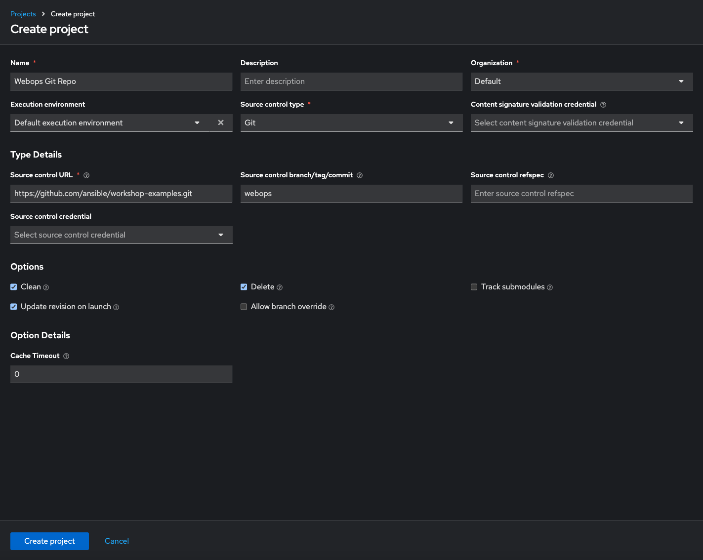
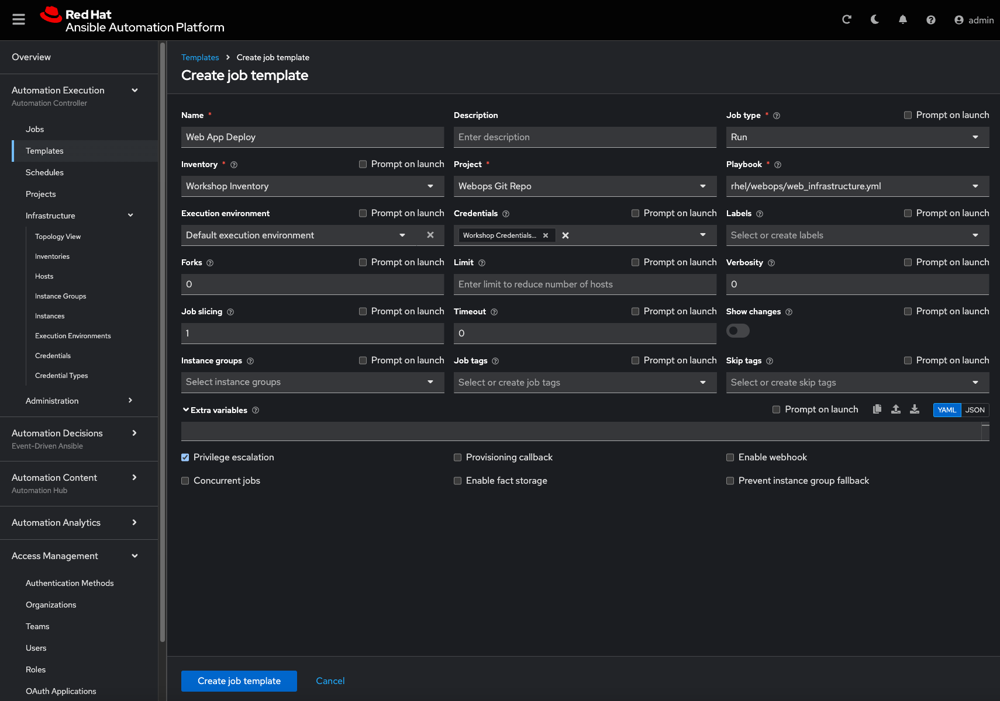
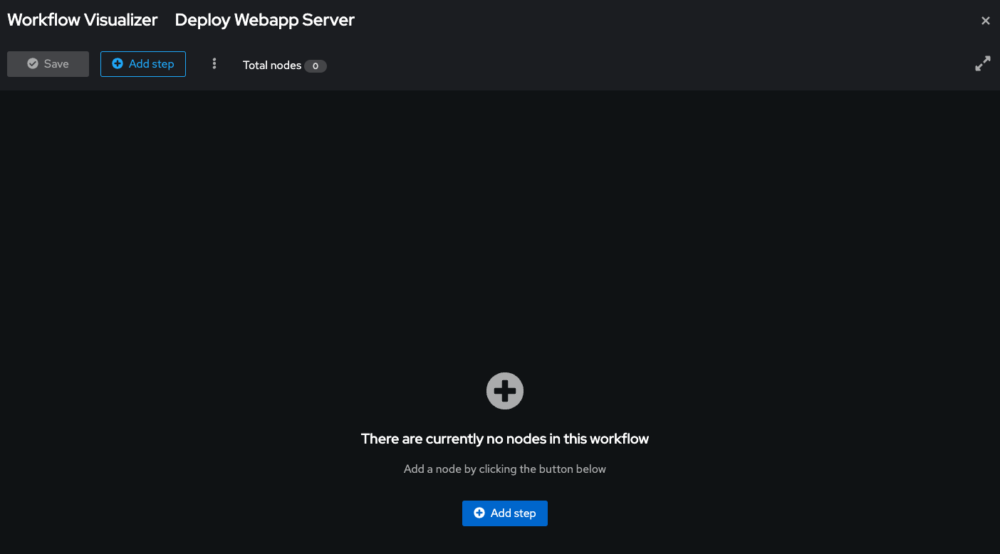
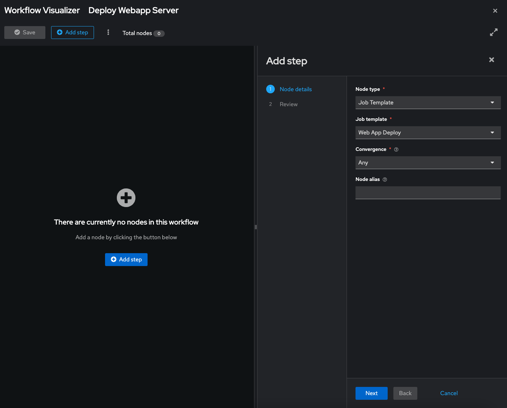
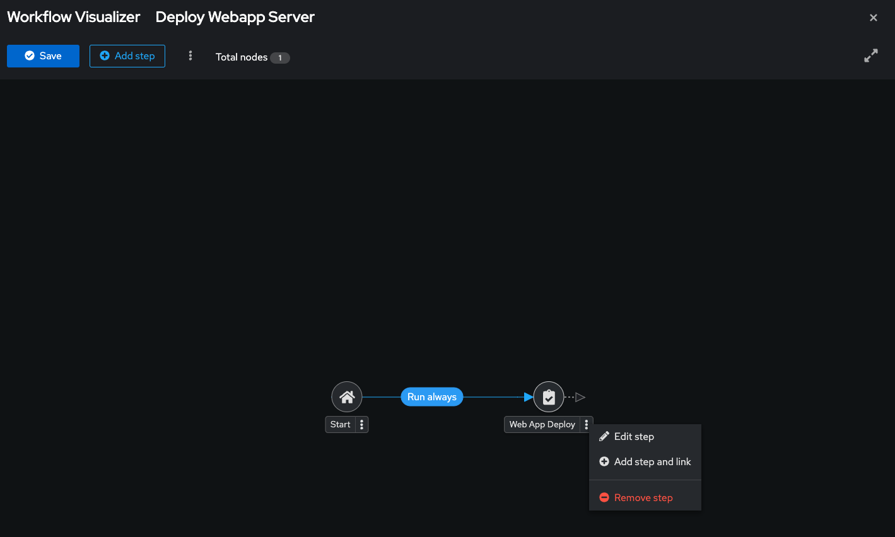
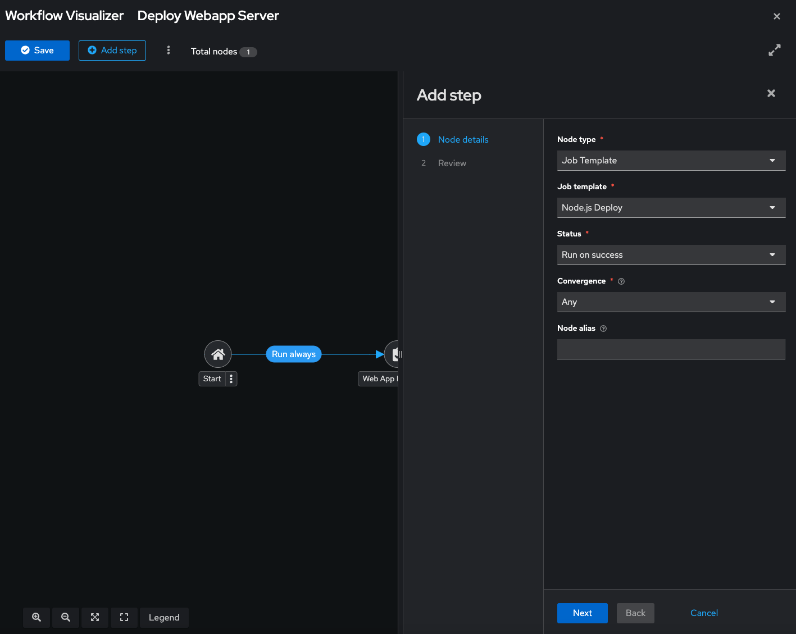
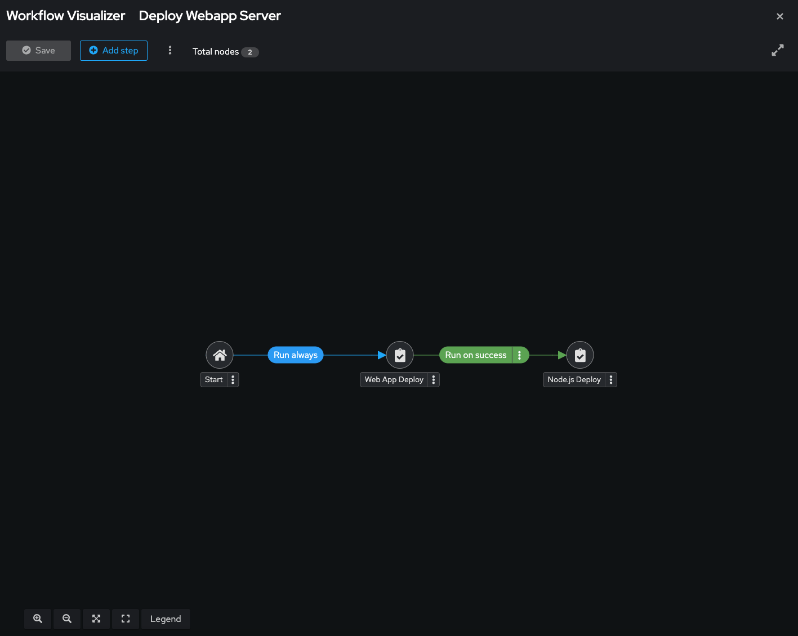
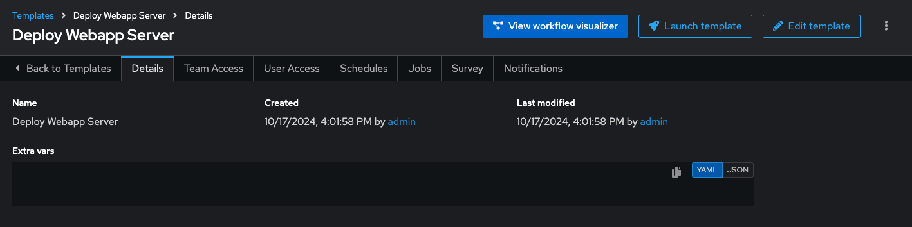

# Workshop Exercise - Workflows

**Read this in other languages**:  
 [English](README.md), [日本語](README.ja.md),  [Portugues do Brasil](README.pt-br.md),  [Française](README.fr.md),  [Español](README.es.md).

## Table of Contents

* [Objective](#objective)
* [Guide](#guide)
  * [Lab scenario](#lab-scenario)
  * [Set up projects](#set-up-projects)
  * [Set up job templates](#set-up-job-templates)
  * [Set up the workflow](#set-up-the-workflow)
  * [Launch workflow](#launch-workflow)

## Objective

The purpose of a workflow is to link multiple job templates together. These templates may or may not share inventory, playbooks, or permissions. The links can be conditional:

* If Job Template A succeeds, Job Template B is executed next.
* If it fails, Job Template C runs instead.

Workflows can include not only job templates but also project or inventory syncs.

This flexibility allows different teams to collaborate efficiently. For example, a networking team can manage its own repositories and inventories, while an operations team handles other aspects. In this lab, you’ll learn how to set up a workflow.

## Create Post-Provisioning Configuration Workflow Job Template
Recall, each job template is tied to a playbook, and we need to stitch together a lot of playbooks to complete a post-provisioning configuration workflow.

> **Tip**
>
> if at any point you’ve had enough practice building out the workflow, or if you get the idea, you can skip to Solution 2 to have ansible create the workflow for you.

> **Tip**
>
>  When creating a workflow, you must click “Save” in the top left of the Wokflow Visualizer.  This will save your progress.  If your session times out before you click “Save” you will lose your progress. **(CLICK SAVE AFTER EACH STEP)**

### Create The Workflow
* Go to **Automation Execution → Templates**** Click **Create Template** → Select **Create workflow job template**. Fill in the form as follows:

 <table>
   <tr>
     <th>Parameter</th>
     <th>Value</th>
   </tr>
   <tr>
     <td>Name</td>
     <td>Init and Deploy Web App 1g</td>
   </tr>
   <tr>
     <td>Organization</td>
     <td>Default</td>
 </table>

* Click **Create workflow job template** 

Preview of finished workflow:

#### Sync Inventory
Sync your inventory first to ensure the newly provisioned servers are in your inventory

* Click ***“+Add Step”***. Fill in the form as follows:

 <table>
   <tr>
     <th>Parameter</th>
     <th>Value</th>
   </tr>
   <tr>
     <td>Node Type</td>
     <td>Inventory Source Sync</td>
   </tr>
   <tr>
     <td>Inventory Source</td>
     <td>Mock Dynamic Inventory Source</td>
   <tr>
     <th>Covergence</th>
     <th>Any</th>
   </tr>
   <tr>
     <td>Node Alias</td>
     <td>Sync Inventory</td>
   </tr>
 </table>

* Click **Next**
* Click **Finish**
			
### Apply Base Config
After successful inventory sync, we will begin applying the base config

* Click **<3 dots>** (right of Sync Inventory)
* Select **+Add step and link**. Fill in the form as follows:

 <table>
   <tr>
     <th>Parameter</th>
     <th>Value</th>
   </tr>
   <tr>
     <td>Node Type</td>
     <td>Job Template</td>
   </tr>
   <tr>
     <td>Job template</td>
     <td>3 - Apply Base Config</td>
   </tr>
   <tr>
     <td>Status</td>
     <td>Run on success</td>
   </tr>
   <tr>
     <th>Covergence</th>
     <th>Any</th>
   </tr>
   <tr>
     <td>Node Alias</td>
     <td>Apply Base Config</td>
   </tr>
 </table>

* Click **Next**
* Click **Finish**

### Deploy Web App
After successful base config, we will begin application deployment
* Click **<3 dots>** (right of Sync Inventory)
* Select **+Add step and link**. Fill in the form as follows:

 <table>
   <tr>
     <th>Parameter</th>
     <th>Value</th>
   </tr>
   <tr>
     <td>Node Type</td>
     <td>Job Template</td>
   </tr>
   <tr>
     <td>Job template</td>
     <td>4 - Deploy Web App 1g</td>
   </tr>
   <tr>
     <td>Status</td>
     <td>Run on success</td>
   </tr>
   <tr>
     <th>Covergence</th>
     <th>Any</th>
   </tr>
   <tr>
     <td>Node Alias</td>
     <td>Deploy Web App 1</td>
   </tr>
 </table>

* Click **Next**
* Click **Finish**

### Add Hosts to Load Balancer
After successful app deploy, we will add the hosts to a load balancer
* Click **<3 dots>** (right of Sync Inventory)
* Select **+Add step and link**. Fill in the form as follows:

 <table>
   <tr>
     <th>Parameter</th>
     <th>Value</th>
   </tr>
   <tr>
     <td>Node Type</td>
     <td>Job Template</td>
   </tr>
   <tr>
     <td>Job template</td>
     <td>5 - Add Hosts to LB</td>
   <tr>
     <td>Status</td>
     <td>Run on success</td>
   <tr>
   <tr>
     <th>Covergence</th>
     <th>Any</th>
   </tr>
   <tr>
     <td>Node Alias</td>
     <td>Add Hosts to LB</td>
   </tr>
 </table>

* Click **Next**
* Click **Finish**

### Add Servers to CMDB
With Workflows, you can run to jobs in parallel.  While we are adding the servers to the LB, we will also add the hosts to our CMDB database.  Play close attention to the steps below:
* Again, Click **<3 dots>** to the right of **Deploy Web App 1**
* Select **+Add step and link** Fill in the form as follows:

 <table>
   <tr>
     <th>Parameter</th>
     <th>Value</th>
   </tr>
   <tr>
     <td>Node Type</td>
     <td>Job Template</td>
   </tr>
   <tr>
     <td>Job template</td>
     <td>6 - Create CMDB Records</td>
   <tr>
     <td>Status</td>
     <td>Run on success</td>
   <tr>
   <tr>
     <th>Covergence</th>
     <th>Any</th>
   </tr>
   <tr>
     <td>Node Alias</td>
     <td>Create CMDB Records</td>
   </tr>
 </table>

* Click **Next**
* Click **Finish**

> **Tip**
>
>  The workflow will update with a fork at Deploy Web App 1

### Create Incident Upon Failure
With Workflows, you can take alternative paths if a job fails.  This is important because it needs to be documented, fixed, or reworked.  Let’s create a node that runs if Deploy Web App 1 fails.

* Again, Click **<3 dots>** to the right of **Deploy Web App 1**
* Select **+Add step and link** Fill in the form as follows:

 <table>
   <tr>
     <th>Parameter</th>
     <th>Value</th>
   </tr>
   <tr>
     <td>Node Type</td>
     <td>Job Template</td>
   </tr>
   <tr>
     <td>Job template</td>
     <td>8 - Create ITSM Incident</td>
   <tr>
     <td>Status</td>
     <td>Run on fail</td>
   <tr>
   <tr>
     <th>Covergence</th>
     <th>Any</th>
   </tr>
   <tr>
     <td>Node Alias</td>
     <td>Create Incident - Deploy Fail</td>
   </tr>
 </table>

* Click **Next**
* Click **Finish**

### Rinse and Repeat
We have now implemented the core features of the workflow, to finish the workflow you would continue to “+Add step and link” to the nodes based on the logic of your environment.  To save time, lets let ansible finish the workflow.  [proceed to solution 2](#solution-2-run-job-template-to-build-post-provisioning-workflow-job-template)

## Solution 2: Run Job Template to build post provisioning workflow job template
* Goto **Automation Execution → Templates** Launch **Solution2 - complete config and deploy workflow** (click rocket)
* After it is finished running, you will see the completed Init and Deploy Web App 1 Workflow Job Template.
* Goto **Automation Execution → Templates**
* Select **Init and Deploy Web App 1** link
* Click the **View Workflow Visualizer button** (located top right)

> **Tip**
>
> Review the various always, success, and failure paths added.  Starting from top and working down:

* After Base Config, Always create a CR and update the CR with “Complete Base Config”
* If Base Config fails, Create an Incident and update the CR accordingly
* After adding hosts to LB, update CR
* After creating incident due to Web App 1 Deploy failure, we update the CR with notes about the failure as well.

Once you have finished reviewing the workload, go ahead and launch the workflow
If you are in the Workflow Visualizer, close it (click the “x” in the top right corner)

Add Job Templates: to see what it’s like to get playbooks into AAP
Automation Execution → Templates →  Create Template
Complete form as follows:
Name: Deploy Web Application
Description: Addition configuration and hardening based on the type of server that is being deployed
Inventory: Mock Inventory
Project: Build Workshop Resources
Playbook: deploy_web_app.yml
Execution environment: Default Execution Environment
Credentials: Workshop Credentials | Machine
Click “Create job template” button

### Lab scenario

You have two departments in your organization:

* **Web operations team:** developing playbooks in their Git branch `webops`.
* **Web developers team:** working in their branch `webdev`.

When a new Node.js server is needed, the following tasks must be performed:

#### Web operations team tasks

* Install `httpd`, `firewalld`, and `node.js`.
* Configure `SELinux` settings, open the firewall, and start `httpd` and `node.js`.

#### Web developers team tasks

* Deploy the latest version of the web application and restart `node.js`.

The web operations team sets up the server, and the developers deploy the application.

> **Note:**  
> For this example, both teams use branches of the same Git repository. In a real scenario, your source control structure may vary.

---

### Set up projects

First, set up the Git repositories as projects.

> **Warning:**  
> If logged in as **wweb**, log out and log in as **admin**.

Within **Automation Execution** -> **Projects**, click **Create Project** to set up the web operations team’s project:

<table>
  <tr>
    <th>Parameter</th>
    <th>Value</th>
  </tr>
  <tr>
    <td>Name</td>
    <td>Webops Git Repo</td>
  </tr>
  <tr>
    <td>Organization</td>
    <td>Default</td>
  </tr>
    <tr>
    <td>Execution Environment</td>
    <td>Default execution environment</td>
  </tr>
  <tr>
    <td>Source control type</td>
    <td>Git</td>
  </tr>
  <tr>
    <td>Source control URL</td>
    <td><code>https://github.com/ansible/workshop-examples.git</code></td>
  </tr>
  <tr>
    <td>Source control branch/tag/commit</td>
    <td><code>webops</code></td>
  </tr>
  <tr>
    <td>Options</td>
    <td><ul><li>✓ Clean</li><li>✓ Delete</li><li>✓ Update Revision on Launch</li></ul></td>
  </tr>
</table>

Click **Create project**. 

Repeat the process to set up the **Webdev Git Repo**, using the branch `webdev`.
<table>
  <tr>
    <th>Parameter</th>
    <th>Value</th>
  </tr>
  <tr>
    <td>Name</td>
    <td>Webdev Git Repo</td>
  </tr>
  <tr>
    <td>Organization</td>
    <td>Default</td>
  </tr>
    <tr>
    <td>Execution Environment</td>
    <td>Default execution environment</td>
  </tr>
  <tr>
    <td>Source control type</td>
    <td>Git</td>
  </tr>
  <tr>
    <td>Source control URL</td>
    <td><code>https://github.com/ansible/workshop-examples.git</code></td>
  </tr>
  <tr>
    <td>Source control branch/tag/commit</td>
    <td><code>webdev</code></td>
  </tr>
  <tr>
    <td>Options</td>
    <td><ul><li>✓ Clean</li><li>✓ Delete</li><li>✓ Update Revision on Launch</li></ul></td>
  </tr>
</table>

---

### Set up job templates

Within **Automation Execution** -> **Templates** -> **Create template** -> **Create job template**, fill out the form with the following values:

<table>
  <tr>
    <th>Parameter</th>
    <th>Value</th>
  </tr>
  <tr>
    <td>Name</td>
    <td>Web App Deploy</td>
  </tr>
  <tr>
    <td>Inventory</td>
    <td>Workshop Inventory</td>
  </tr>
  <tr>
    <td>Project</td>
    <td>Webops Git Repo</td>
  </tr>
  <tr>
    <td>Playbook</td>
    <td><code>rhel/webops/web_infrastructure.yml</code></td>
  </tr>
  <tr>
    <td>Execution Environment</td>
    <td>Default execution environment</td>
  </tr>
  <tr>
    <td>Credentials</td>
    <td>Workshop Credentials</td>
  </tr>
  <tr>
    <td>Options</td>
    <td>tasks need to run as root so check **Privilege Escalation**</td>
  </tr>
</table>

Click **Create job template**, and then repeat the process for the **Node.js Deploy** template, changing the project to **Webdev Git Repo** and the playbook to `rhel/webdev/install_node_app.yml`.

---

### Set up the workflow

Within **Automation Execution** -> **Templates** -> **Create template** -> **Create workflow job template**, fill in the details:

<table>
  <tr>
    <th>Parameter</th>
    <th>Value</th>
  </tr>
  <tr>
    <td>Name</td>
    <td>Deploy Webapp Server</td>
  </tr>
</table>

Click **Create workflow job template** to open the **Workflow Visualizer**. 

Click the **Add Step** button and assign the **Web App Deploy** job template to the first node. Add a second node by clicking the 3 dot sign, selecting the "Add step and link"  and assign the **Node.js Deploy** template with the **Run on success** status type. Select **Next** and **Finish** to complete the workflow.

Click **Save** to finalize the workflow.

---

### Launch workflow

Within the **Deploy Webapp Server** template, click **Launch template**. 

Once the workflow completes, verify the result.

Go to Automation Execution → Infrastructure → Inventories → Workshop Inventory

In the **Automation Execution → Infrastructure → Inventories → Workshop Inventory, select the Hosts tab and select node1 and click Run Command

Within the Details window, select Module command, in Arguments type `curl http://node1/nodejs` and click Next.

Within the Execution Environment window, select Default execution environment and click Next.

Within the Credential window, select Workshop Credentials and click Next.

Review your inputs and click Finish.

Verify that the output result shows `Hello World`

---
**Navigation**
 
[Previous Exercise](../2.3-jobtemplates/) - [Next Exercise](../2.5-surveys/)

[Click here to return to the Ansible for Red Hat Enterprise Linux Workshop](../README.md#section-2---ansible-tower-exercises)
