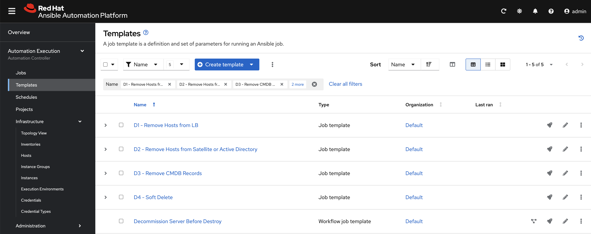

# Exercise - Surveys

## Table of Contents

- [Exercise - Surveys](#exercise---surveys)
  - [Table of Contents](#table-of-contents)
  - [Objective](#objective)
  - [Guide](#guide)
    - [Launch "Solution3 - Decommission Workflow Job Template](#launch-solution3---decommission-workflow-job-template)
    - [Add a Survey to "Decommission Server Before Destroy" WFJT](#add-a-survey-to-decommission-server-before-destroy-wfjt)
    - [Create a survey for "Decommission Server Before Destroy" WFJT](#create-a-survey-for-decommission-server-before-destroy-wfjt)
    - [Launch "Decommision Server Before Destroy"](#launch-decommision-server-before-destroy)

## Objective

Demonstrate the use of the Ansible Automation Controller [survey feature](https://docs.redhat.com/en/documentation/red_hat_ansible_automation_platform/latest/html/using_automation_execution/controller-job-templates#controller-surveys-in-job-templates). Surveys allow for setting extra variables for the playbook, similar to ‘Prompt for Extra Variables,’ but in a user-friendly Q&A format. They also allow for validation of user input.

## Guide

You've already provisioned and configured new resources, but what about decommisioning:

In this exercise, we will:
  * launch Solution 3 (we've already experienced ease of stitching together jobs to make a workflow)
  * Edit the resulting Workflow by adding a survey

> **Tip**
> The survey feature provides a simple query for data but does not support dynamic data queries, nested menus, or four-eye principles.

### Launch "Solution3 - Decommission Workflow Job Template"
This time we will let ansible do most of the heavy lifting, so lets launch Solution 3.

* Goto **Automation Execution → Templates** and launch  **Solution3 - Decommission Workflow Job Template**
* Once it is done running, Goto **Automation Execution → Templates** 
> **Tip**
>
> Observer the resources created by Solution 3 JT:

* **D1 - Remove Hosts from LB:** Working backwards from the provisioning workflow, D1 removes the hosts from the load balancer

* **D2 - Remove Hosts from Satellite or Active Directory:** Depending on whether the OS is RHEL or Windows, you can remove records from Red Hat Satellite or Windows Active Directory (or any other tools used to manage your infrastructure)

* **D3 - Remove CMDB Records:** If you have a single source of truth for your infrastructure, you will need to update the record to indicate that the server has been decommisioned.

* **D4 - Soft Delete:** Finally, you can remove the server from AAP itself to free up an AAP managed node entitlement (If indeed, the server will no longer need to be managed by AAP).

* **Decommission Server Before Destroy:** And finally, the workflow that stitches the jobs above along with other jobs for ITSM tracking (i.e. creating CR, updating CR, creating Incidents upone failure, etc...)

### Add a Survey to "Decommission Server Before Destroy" WFJT
Now that all the resources are present to decommission the server, we need a way to know which servers to decommission. In a Terraform + AAP integrated environment, Terraform would make an API call to AAP's restAPI and AAP would gather the diff between plan and actual resources that are provisioned.  If there are servers that are "planned" to be destroyed, then this would be passed to our **Decommission Server Before Destroy** WFJT.  

Since we don't have an integration for this lab, we will use a survey to define which servers are to be destroyed.

### Create a survey for "Decommission Server Before Destroy" WFJT

* Goto **Automation Execution → Templates** Click the link for **Decommission Server Before Destroy**
* Select the **Survey** tab at the top
* Click **Create Survey Question** Fill out the form as follows:

 <table>
   <tr>
     <th>Parameter</th>
     <th>Value</th>
   </tr>
   <tr>
     <td>Question</td>
     <td>Which servers would you like to destroy?</td>
   </tr>
   <tr>
     <td>Answer variable name</td>
     <td>vm_names</td>
   <tr>
     <td>Answer type</td>
     <td>Multiple Choice (multiple select)</td>
   <tr>
   <tr>
     <td>Required</td>
     <td>Checked</td>
   </tr>
   <tr>
     <td>Multiple Choice Options</td>
     <td>
       node1.example.com (press enter) 
       node2.example.com (press enter) 
       node3.example.com (press enter) 
     </td>
   </tr>
 </table>

* Click **Create Survey Question**
* Toggle on **Survey disabled** (will then show **Survey enabled**)

### Launch "Decommision Server Before Destroy"
You should still be in the **Decommision Server Before Destroy** WFJT, so you can just click **Launch Template**

* The survey should automatically lunch
* Select Nodes 2 & 3 → Click **Next**
* Click **Finish**
> **Tip**
>
> [Node selection](images/survey_node_selection.png)

---
**Navigation**
 


[Previous Exercise](../4-variables) - [Next Exercise](../../ansible_rhel_90/6-system-roles/)

[Previous Exercise](../2.4-workflows/) - [Next Exercise](../2.6-rbac/)

